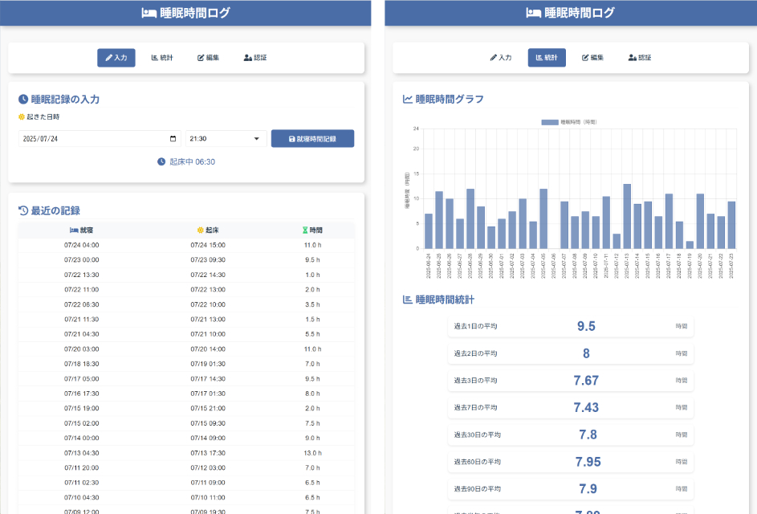

# 🛏️ 睡眠時間ログ

このWebアプリは、日々の睡眠時間を手軽に記録・可視化できる、シンプルな自己管理用ツールです。
（不要）


---

## 🔧 特徴

- 睡眠記録の入力（就寝時間・起床時間）
- 30分単位での入力
- 睡眠記録一覧表示（直近の記録）
- 睡眠時間の棒グラフによる可視化
- 過去1日〜1年の平均睡眠時間を自動計算・表示
- パスワード認証による編集ロック
- データはサブディレクトリ`sleep_data/`に安全に保存

---

## 📄 ファイル構成

```
sleep_tracker/
├── index.php         ... メインアプリ本体
├── sleep_data/       ... データ保存用ディレクトリ（自動生成）
│   ├── .password     ... パスワード（初回起動時に設定・自動生成）
│   ├── log.csv       ... 睡眠記録データ（自動生成）
│   └── .htaccess     ... ディレクトリ保護用（自動生成）
├── README.md         ... このファイル（不要）
└── screenshots.jpg   ... スクリーンショット等（不要）
```

- `sleep_data/`配下のファイルは、アプリ初回起動時または記録時に自動生成されます。
- `.htaccess`により、`sleep_data/`ディレクトリはWebから直接アクセスできません。

---

## 🚀 初回起動時の流れ

1. `sleep_data/.password`が存在しない場合、パスワード設定画面が表示されます。
2. パスワードを設定すると`.password`ファイルが生成され、以降は認証画面が表示されます。
3. パスワードを知っているユーザーのみが記録・編集できます。

---

## 🔑 パスワード認証について

- パスワードは`sleep_data/.password`に保存されます（平文）。
- 認証後はブラウザごとに書き込みロックが解除されます。
- パスワードを忘れた場合は`sleep_data/`ディレクトリごと削除して再設定してください。

---

## 🕒 入力ルール

- **就寝時間と起床時間は30分単位**で選択・入力します。
- 翌日にまたがる睡眠時間も自動的に処理されます。

---

## 📊 表示される統計

- 睡眠時間のグラフ（棒グラフ）
- 過去1日、2日、3日、7日、30日、60日、90日、半年、1年の平均睡眠時間
- 記録開始日・記録期間・総記録回数

---

## 📁 保存形式

記録は `sleep_data/log.csv` にCSV形式で保存されます。  
日付・就寝時刻・起床時刻・睡眠時間が自動で記録され、繰り返し閲覧・分析できます。

---

## ♻️ データの初期化・リセット

- 記録やパスワードをリセットしたい場合は、`sleep_data/`ディレクトリごと削除してください。
- 次回アクセス時に再度パスワード設定画面が表示されます。

---

## 🔒 セキュリティ上の注意

- パスワードは平文で`sleep_data/.password`に保存されます。外部からアクセスできないよう、`.htaccess`で保護されていますが、サーバー設定によっては追加の対策が必要な場合があります。
- サーバーのバックアップや移行時は`sleep_data/`ディレクトリごとコピーしてください。

---

## 📝 備考

- データベースは使用していません。
- ファイル単体で動作するため、簡単に設置・運用が可能です。
- ご自由にご利用・改変ください。
